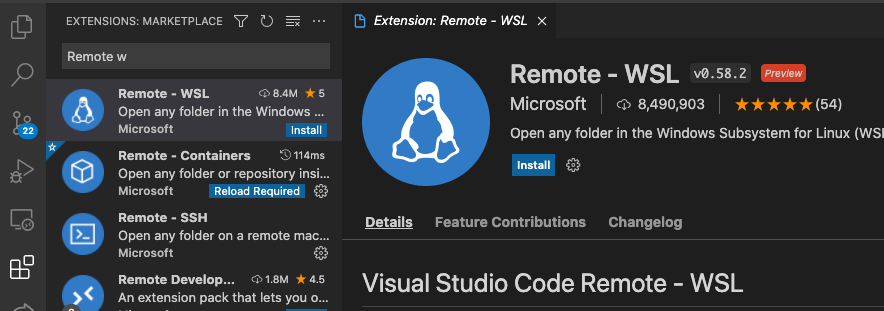
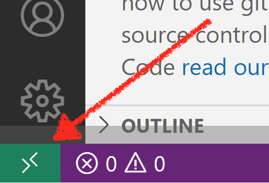
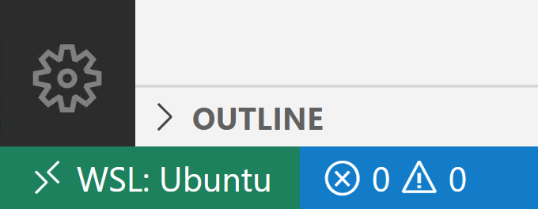
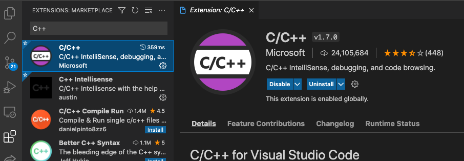

# Uppsetning á þróunarumhverfi

## Linux

Mismunandi eftir dreifingum en fyrir t.d. Ubuntu, keyra eftirfarandi í terminal:

```bash
sudo apt install build-essential gdb
```

## macOS

Opna terminal og keyra eftirfarandi skipun:

```bash
xcode-select --install
```

## Windows

**Byrja á að setja upp Ubuntu í Windows Subsystem for Linux, sjá leiðbeiningar [hér](./WSL.md).**

Þegar því er lokið (muna að uppfæra Ubuntu), þarf að keyra eftirfarandi línu í Ubuntu terminal:

```bash
sudo apt install build-essential gdb
```

### Tengja VSCode við Ubuntu í Windows

Við viljum keyra VSCode í Windows en þýða (e. compile) og keyra forritin með Ubuntu vélinni. Við þurfum því að segja VSCode hvernig það á að nálgast Ubuntu vélina.

Til að þetta sé hægt þarf að setja inn viðbótina *Remote - WSL* í VSCode.



### Opna Windows möppu í Ubuntu með VSCode

Til að opna möppu frá Windows í Ubuntu með VSCode þarf að smella á græna táknið neðst í vinstra horninu á VSCode glugganum.



Velja svo að opna möppu til að opna í WSL.


Ef allt hefur hepnast eðlilega ætti táknið neðst til hægri að vera svona:



## VSCode - öll stýrikerfi

Sækja og setja upp Visual Studio Code ef það er ekki þegar sett upp á vélinni.

Búa sér til eina möppu sem kemur til með að innihalda öll forritin sem þið skrifið í áfanganum.

Dæmi:

- Linux: ```/home/nafn/Documents/Skóli/FORR3CG```
- macOS: ```/Users/nafn/Documents/Skóli/FORR3CG```
- Windows: ```C:\Users\nafn\Documents\Skóli\FORR3CG```

**ATH.** Öll forrit sem við skrifum í áfanganum þurfa að eiga sér sína eigin möppu. Þær möppur þurfa að vera í FORR3CG möppunni.

Í þeirri möppu (t.d. FORR3CG) þarf að búa til aðra möppu sem á að heita ```.vscode``` (ath. punkturinn er hluti af nafninu).

Í ```.vscode``` möppunni þarf svo að búa til skránna ```tasks.json``` og í þá skrá þarf að afrita eftirfarandi (skránna má líka sækja [hér](https://gist.github.com/gestskoli/9c9409bad2ab5f56a649dff76b8be4e6)):

```json
{
  // See https://go.microsoft.com/fwlink/?LinkId=733558
  // for the documentation about the tasks.json format
  "version": "2.0.0",
  "tasks": [
    {
      "label": "build",
      "type": "shell",
      "command": "g++ -g -Wall -Wextra \"${fileDirname}/\"*.cpp -o \"${workspaceFolderBasename}\" && \"./${workspaceFolderBasename}\"",
      "problemMatcher": []
    }
  ]
}
```

Næst þarf að setja inn C++ viðbótina (e. extension) í VSCode með því að fara í Extensions (Ctrl+Shift+x / Cmd+Shift+x) og leita að C++. Setja svo inn viðbótina frá Microsoft.



Þá ætti þróunarumhverfið að vera klárt. Til að próf hvort svo sé má búa til nýja möppu í forritamöppunni (t.d. FORR3CG) og kalla hana *Forrit1*. Í *Forrit1* möppunni er svo búin til skráin **main.cpp** og eftirfarandi kóði settur í hana:

```c++
#include <iostream>

int main() {
  std::cout << "Fyrsta C++ forritið\n";
  return 0;
}
```

Til að þýða (e. compile) og keyra forritið er smellt á `Ctrl-Shift-B` (`Cmd-Shift-B` á macOS) og svo valið *build and run*.
